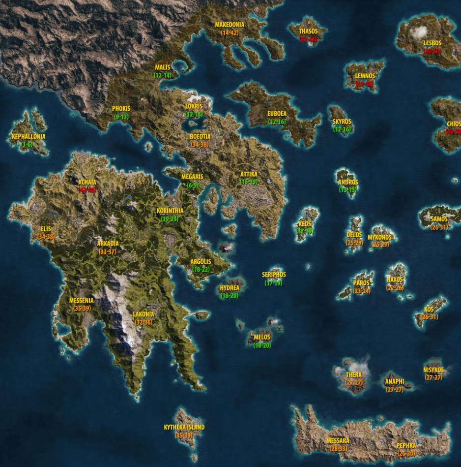

# Reações

**Número da Lista**: 7

**Conteúdo da Disciplina**: Grafos 2

## Alunos
|Matrícula | Aluno |
| -- | -- |
| 18/0099353  |  Cibele Freitas Goudinho |
| 16/0127327  |  João Paulo Coelho de Souza |

## Sobre 
Nesse projeto visamos aplicar os conhecimentos de Grafos 2 trazendo para o contexto do jogo Assassin's Creed Odyssey. Nossa aplicação gera um grafo com peso nas arestas com base no mapa do jogo, onde as cidades são os nós e as arestas são a distância mais o nível necessário para cada cidade (os pesos estão definidos na imagem 1). O objetivo do projeto é ajudar os jogadores à achar a melhor rota para que ele chegue em uma cidade destino de sua escolha considerando seu nível e a distância em jogo de uma cidade para outra.  

## Screenshots
### Caminhos entre as cidades

### Mapa Original


## Instalação 
**Linguagem**: Python e ReactJS<br>
**Framework**: FastAPI<br>
Precisa rodar o front e o back ao mesmo tempo, recomenda-se utilizar dois terminais para tal, um na pasta back e outra na pasta front.
### Dentro da pasta back: 
Pode ser que utilize python ao invés de python3 (válido para todos os comandos)

Criar env:
```
python3 -m venv .venv
```
Ativar env:
```
source .venv/bin/activate
```
Instalar requirements:
```
pip install -r requirements.txt
```
Rodar o projeto:
```
uvicorn main:app --reload 
```
### Dentro da pasta front:

```
npm install
```
```
npm start
```
## Uso 
1. Escolha seu nível correspondente ao seu nível no jogo Assassin's Creed Odyssey (válido de 1 a 19) 
2. No primeiro dropdown escolher qual das cidades quer começar com base no nível escolhido 
3. No segundo dropdown escolher qual seria a cidade destino desejada
4. Clicar em enviar
5. Se quiser fazer uma nova consulta clicar em refazer 

## Outros 
Projeto baseado no jogo [Assassin's Creed Odyssey](https://www.ubisoft.com/pt-br/game/assassins-creed/odyssey).


